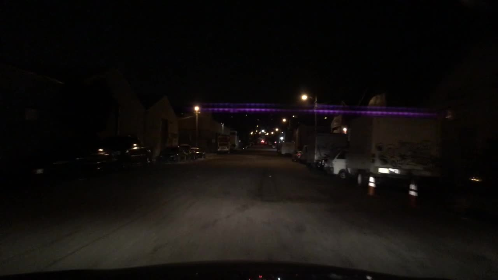
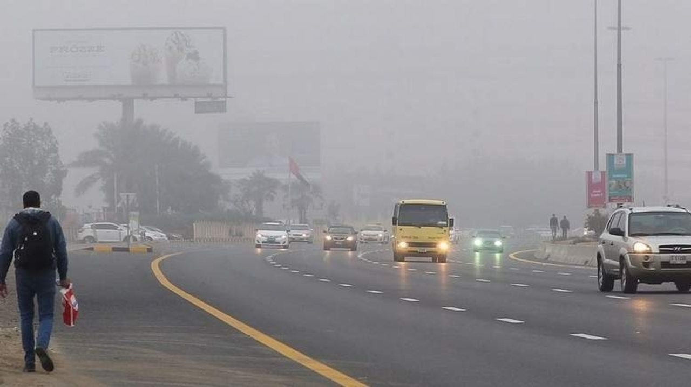

## Repository of the paper: "On the Importance of Dual-Space Augmentation for Domain Generalized Object Detection"
- Note: Our codes are based on [DINO](https://github.com/IDEA-Research/DINO).

### Preparation
- Build environment using Dokcerfile:  
    `docker build - < Dockerfile -t dualaug:latest`
- Clone this repo:  
    `git clone git@github.com:Hayoung93/DualAug.git`
- Install DINO:  
    ```
    cd /workspace/DualAug/models/dino/ops
    bash make.sh
    ```

### Inference on sample image
- Download model weight from the [release](https://github.com/Hayoung93/DualAug/releases) page.
```
python visualize.py --input_image {INPUT_IMAGE} --model_weight checkpoint-inference.pth
```
- The result will be saved as `{INPUT_IMAGE_NAME}_predBox.png`
- Sample results
<p align="center">
  
  
  
   
</p>
<p align="center">
  
  
  
   
</p>
